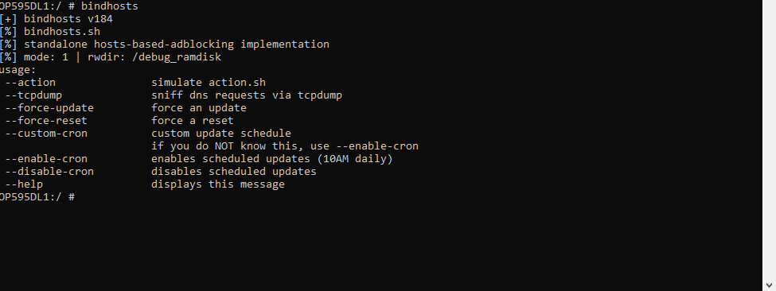

# 使用手册

## 通过终端使用

为了在使用 Magisk/KernelSU/APatch 时均能访问如图所示的多个选项，您必须在拥有 su 权限的前提下，通过 Termux (或者其他类似的终端app) 或者 adb shell 输入: bindhosts 并跟随您所需的参数 (选项)。

例如: 
         
         bindhosts --action ---> 模拟bindhosts的action操作应用规则或重置hosts文件，这取决于bindhosts当前正处于何种运行模式
         bindhosts --tcpdump ---> 通过您当前的网络模式 (WiFi或数据，确保没有使用像CloudFlare之类的DNS服务) 嗅探当前活动的IP地址
         bindhosts --force-reset ---> 强制重置bindhosts，这意味着重置host文件为空
         bindhosts --custom-cron ---> 为bindhosts设定一天中运行定时任务的时刻
         bindhosts --enable-cron ---> 为bindhosts启用定时任务以更新您当前使用的列表中的 (默认情况下是早上十点)
         bindhosts --disable-cron ---> 为bindhosts禁用和删除之前设置的定时任务
         bindhosts --help ---> 显示帮助信息 (上述图像和文本展示的内容)

## action
 点击 action 以在更新和重置的状态间切换
 
 

## webui
  添加您的自定义规则、规则（源）、白名单或黑名单。
 
 

